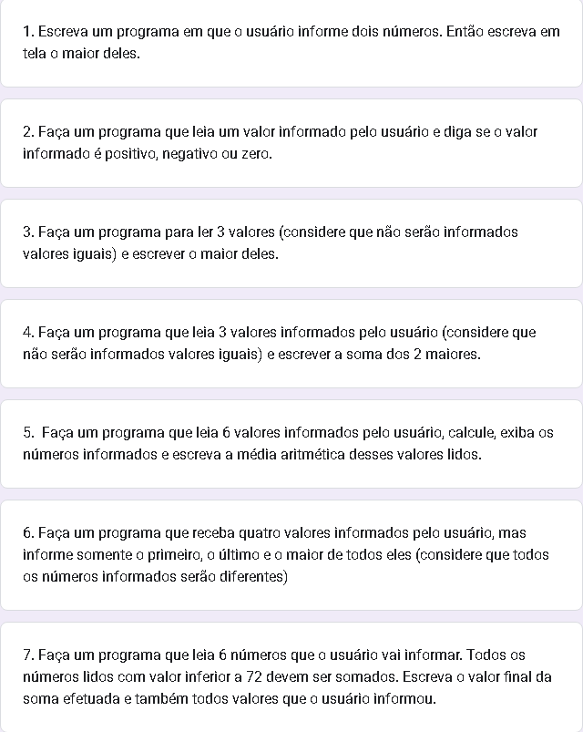

# Logica de Programacao com Portugol

Repositório para guardar as listas de exercicios de Logica de Programação com Portugol passada pelo Professor Gabriel Augusto Do Instituto Proa 

## Hora de codar 1 : {Portugol}

Lista de exercicos para descobrir a area de formas bom para entender a sintaxe do portugol

## Hora de codar 2 : A Vingança do Coder

Lista de exercicios usando condicional: se, senao se, senao e escolha caso.

## Hora de codar 3 : De volta ao Código
Lista de exercicios usando laço de repetição: enquanto e para.

## Caixa eletronico : O Troco

Exercicio que uni os conteudos praticados + o uso de funções, um exercicio completo com varias funcionalidades

## Lista Hora de codar 1

## Lista Hora de codar 2

## Lista Hora de codar 3

## Caixa eletronico

https://github.com/julliakathelyn
